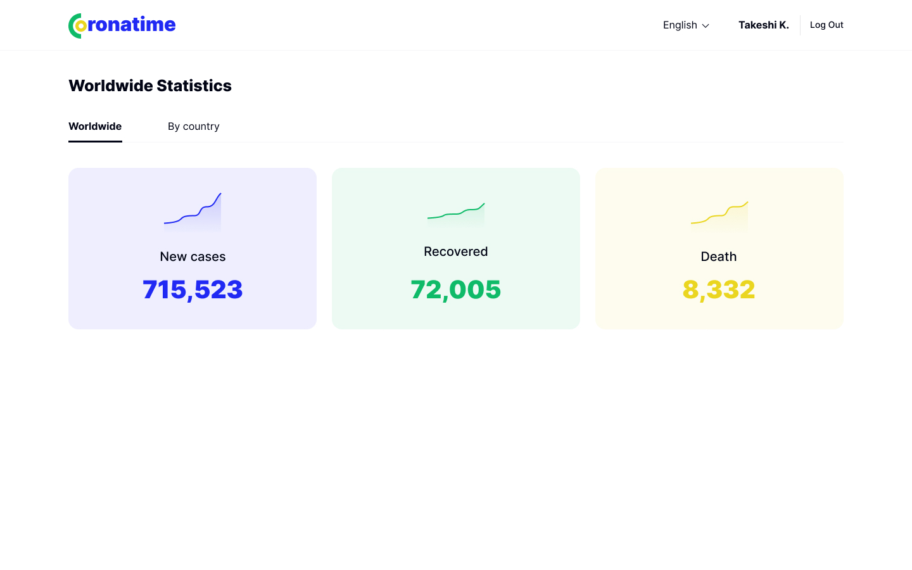
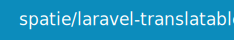
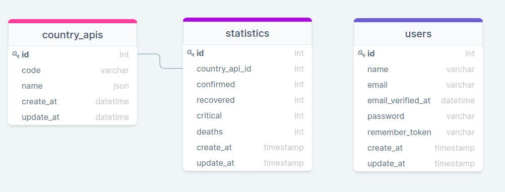

## Table of Contents
- [Table of Contents](#table-of-contents)
- [About the application](#about-the-application)
- [App looks like](#app-looks-like)
- [Prerequisites](#prerequisites)
- [Package](#package)
- [Install and Run](#install-and-run)
- [Database structure](#database-structure)
- [Resources](#resources)

## About the application
CoronaTime is an app where you can view world statistics. You can also search for a specific country and view its statistics. The app is available in two languages.
## App looks like

## Prerequisites
| #        | NAME     | VERSION        | Check Version |
| :---     | :---:    |     :---:      |       :---: |
|          | <a href="https://getcomposer.org/" target=_blank>composer</a> | ^2.1.8     | comopser --version    |
|          | <a href="https://nodejs.org/en/" target=_blank>node</a>     | ^16.13.0     | node -v     |
|          | <a href="https://docs.npmjs.com/cli/v8/configuring-npm/install" target=_blank>npm</a>    | ^8.3.1       | npm -v      |
|          | <a href="https://www.sqlite.org/index.html" target=_blank>SQLite</a> | ^3.31.1     | sqlite3 --version   |

## Package

## Install and Run 

1. Download ZIP file or Clone this repository.
2. Install composer: Run the command `composer i`
3. Install npm: Run the command `npm i`
4. Style optimization: Run the command `npm run dev`
5. Create env file Run the command `cp .env.example .env`
6. Create database Run the command `database/database.sqlite` 
7. Run the database migrations `php artisan migrate`
8. Set the application key: Run the command `php artisan key:generate`
9. Create data: Run the command `php artisan data:generate`
  
> **_NOTE:_** The data is automatically updated daily

## Database structure 

## Resources
* [figma Designs](https://www.figma.com/file/O9A950iYrHgZHtBuCtNSY8/Coronatime?node-id=0%3A1)
* [APIs](https://devtest.ge/api)
* [DrawSQL](https://drawsql.app/redberry-14/diagrams/coronatime#) 
* [tailwindcss](https://tailwindcss.com/) 
  

